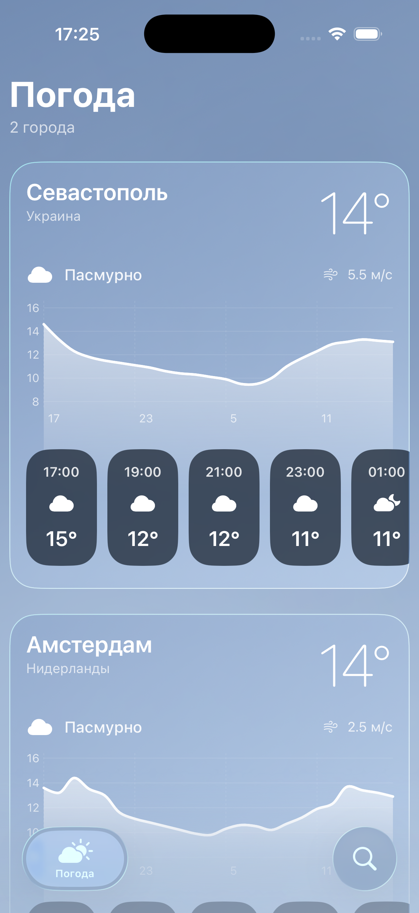
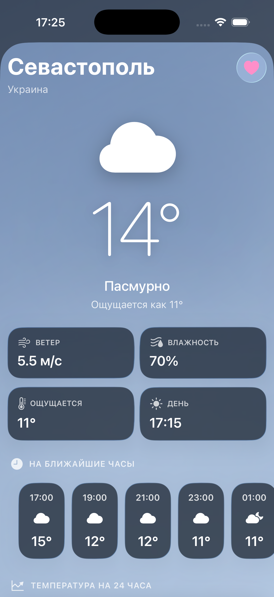
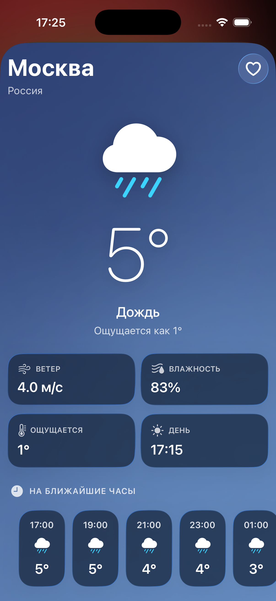
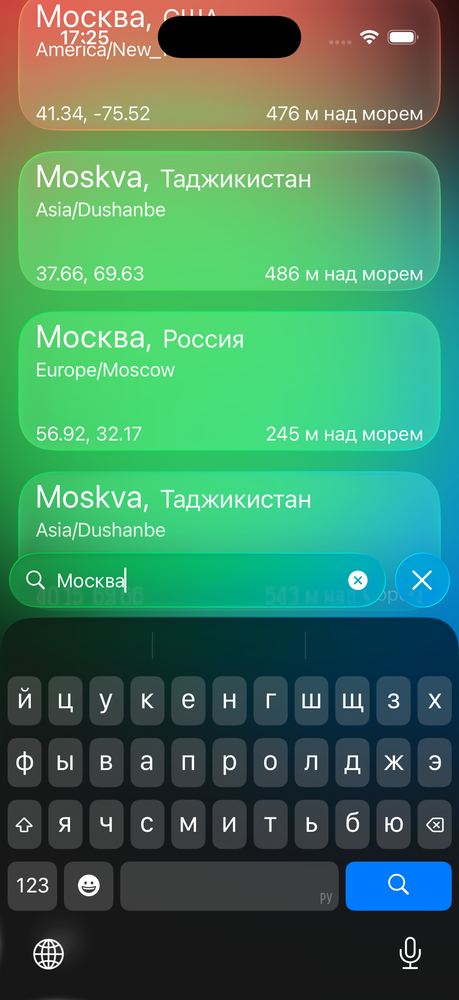

Simple IOS App that fetching weather info from OpenMeteo API JSON pack.
Same features as my old project, Liquid Glass, Apple human interface guideline etc..
---

Some Screenshots from sim:
------------------------------------------
   
 
  

 Planning Image :
 ------------------------------------------

  
